<p align="center">
  
</p>

<p align="center"><strong>Frontier models for programmable biology</strong></p>

<p align="center">
  Go control plane&nbsp;&nbsp;·&nbsp;&nbsp;Rust runtime&nbsp;&nbsp;·&nbsp;&nbsp;Python science&nbsp;&nbsp;·&nbsp;&nbsp;TileLang kernels&nbsp;&nbsp;·&nbsp;&nbsp;TypeScript products
</p>

<p align="center">
  
  
  
  
</p>

# Mindclade internal monorepo

Mindclade's production-oriented, polyglot platform for biomolecular data
ingestion, preprocessing, model training, evaluation, and inference. Bazel owns
the build graph, Nix owns pinned toolchains and execution environments, and
versioned contracts connect the language domains.

> [!IMPORTANT]
> This repository has mixed maturity. A path can reserve a target-state boundary
> without being production-ready. Check [`components.toml`](components.toml),
> [`SCAFFOLD_STATUS.md`](SCAFFOLD_STATUS.md), and
> [`QUALIFICATION.md`](QUALIFICATION.md) before depending on a component.

## Start here

### 1. Enter the pinned development environment

Install [Nix](https://nixos.org/download/) with flakes enabled, then run these
commands from the repository root:

```bash
tools/dev/nixw develop .#default
python3 ci/presubmit/pipeline.py --static-only
```

The first command opens the standard development shell. The second runs the
provider-independent architecture and repository checks used by presubmit.

### 2. Explore a runnable vertical slice

The local Go examples use in-memory adapters and do not require cloud provider
credentials:

```bash
go run ./examples/go/control_plane_api/cmd/control-plane-api
go run ./examples/go/event_dispatcher
go run ./examples/go/ingestion_coordinator
```

See the [integration examples guide](docs/guides/go-integration-examples.md) for
the responsibilities and expected behavior of each slice.

### 3. Choose the relevant validation lane

- Run `tools/qualification/go/validate.sh offline` for the implemented Go
  foundation.
- Run `tools/dev/bazelw test //...` for the repository Bazel graph.
- Use [`VALIDATION.md`](VALIDATION.md) for exact connected-provider and release
  qualification requirements.

## Platform map

```mermaid
flowchart LR
    products["Apps + SDKs"] --> contracts["Versioned protocols"]
    contracts --> control["Go control plane"]
    contracts --> runtime["Rust runtime"]
    control --> science["Data + preprocessing"]
    science --> models["Models + training"]
    models --> evaluation["Evaluation + qualification"]
    evaluation --> releases["Qualified releases"]
    releases --> runtime
    runtime --> serving["Serving + workers"]

    classDef product fill:#FBFAF7,stroke:#B5673F,color:#201C24,stroke-width:2px;
    classDef authority fill:#201C24,stroke:#201C24,color:#FBFAF7,stroke-width:2px;
    classDef execution fill:#F2EFE8,stroke:#B5673F,color:#201C24,stroke-width:2px;
    class products product;
    class contracts,control,releases authority;
    class runtime,science,models,evaluation,serving execution;
```



The diagram shows authority and flow, not component readiness. Use the status
sources linked above before depending on any node.

| Area | Responsibility | Entry point |
| --- | --- | --- |
| Product surfaces | Internal applications and generated client libraries | [`apps/`](apps/), [`sdk/`](sdk/) |
| Contracts | Protobuf, OpenAPI, events, mappings, and compatibility policy | [`protocols/`](protocols/) |
| Control plane | Durable policy, orchestration, scheduling, registry, and audit | [`control/`](control/), [`services/control_plane/`](services/control_plane/) |
| Data and science | Ingestion, curation, preprocessing, models, and training | [`data/`](data/), [`preprocessing/`](preprocessing/), [`models/`](models/), [`training/`](training/) |
| Runtime and serving | Online admission, node execution, artifacts, batching, and inference | [`services/`](services/), [`serving/`](serving/) |
| Quality and operations | Evaluation, qualification, infrastructure, CI, and repository tooling | [`evaluation/`](evaluation/), [`tests/`](tests/), [`infra/`](infra/), [`ci/`](ci/), [`tools/`](tools/) |

The canonical cross-system design is the
[system design reference](docs/architecture/system-design-reference.md). The
[traceability map](docs/architecture/system-design-traceability.md) connects its
decisions to source, tests, and qualification evidence.

## Engineering boundaries

| Language | Owns |
| --- | --- |
| Go | Fleet control plane, durable workflow state, and policy |
| Rust | Online/runtime data plane, node execution, and bounded byte movement |
| Python | Scientific, model, training, inference, and evaluation numerics |
| TileLang | Qualification-gated accelerator kernels |
| TypeScript | Product surfaces and generated web clients |

Reusable mechanisms belong under [`libs/`](libs/); deployable composition roots
belong under [`services/`](services/). Cross-process and cross-language data uses
versioned contracts under [`protocols/`](protocols/) rather than
language-private structures. The enforced dependency direction is documented in
[`docs/architecture/dependency-rules.md`](docs/architecture/dependency-rules.md).

## Documentation paths

- [Engineering documentation](docs/README.md) — architecture, decisions,
  guides, runbooks, security, and qualification evidence
- [Repository status](REPOSITORY_STATUS.md) — implemented foundations and
  connected qualification still required
- [Scaffold status](SCAFFOLD_STATUS.md) — substantive, partial, and reserved
  areas
- [Qualification](QUALIFICATION.md) — recorded evidence and promotion gates
- [Contributing](CONTRIBUTING.md) — environment, boundaries, workflow, and
  security expectations
- [Security](SECURITY.md) — private reporting and repository security policy

## Build ownership

- **Bazel** owns build, test, generation, images, qualification, and release
  outputs. The repository is Bzlmod-only.
- **Nix** owns pinned toolchains and developer/CI execution environments.
- **Repository wrappers** in [`tools/dev/`](tools/dev/) keep local invocations
  aligned with checked-in pins and configuration.

Do not infer readiness from a successful build or the presence of a file. A
production claim requires implementation, current qualification, ownership,
operational expectations, security review, release evidence, and rollback.

## Contributing

Read [`CONTRIBUTING.md`](CONTRIBUTING.md) before changing a durable boundary.
Changes that cross language or dependency boundaries require an accepted ADR or
an update to the governing decision. Never commit credentials, private datasets,
model-weight secrets, hidden evaluation material, patient information, or
proprietary partner data.

---

Mindclade proprietary and confidential. See [`LICENSE`](LICENSE) and
[`NOTICE`](NOTICE).
