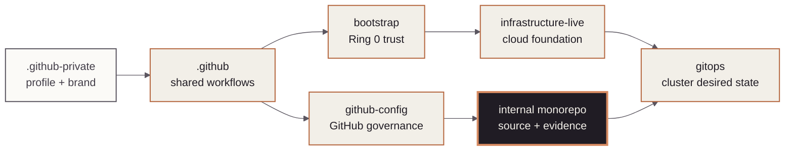

<!-- mindclade-doc: repository-home@2 -->
<!-- Brand source: mindclade/.github-private/mindclade-brand-assets (MONO family). -->

<p align="center">
  <picture>
    <source media="(prefers-color-scheme: dark)" srcset="docs/assets/brand/mono-wordmark-dark-1080w.png">
    <source media="(prefers-color-scheme: light)" srcset="docs/assets/brand/mono-wordmark-1080w.png">
    
  </picture>
</p>

<p align="center">
  
  
  
  
  
</p>

# Mindclade · Internal Monorepo

> **Programmable biology · Product and model source**
> Build and qualify the polyglot product, control-plane, data, model, training, evaluation,
> serving, and SDK source behind Mindclade systems.

| Repository contract | Value |
| --- | --- |
| Class | `source-monorepo` |
| Visibility | `internal` |
| Change model | `pull-request` |
| Authority | `application-source`<br>`platform-source`<br>`model-source`<br>`training-source`<br>`data-source`<br>`serving-source`<br>`sdk-source`<br>`bazel-build-graph`<br>`qualification-policy`<br>`release-artifact-definitions` |
| Start here | [`docs/README.md`](docs/README.md) |

## Mission

This repository is Mindclade's domain-oriented, polyglot source estate. Bazel owns the build,
test, generation, image, qualification, and release graph; Nix owns pinned host toolchains and
execution environments; versioned contracts connect Go, Rust, Python, TileLang, and TypeScript.

> [!IMPORTANT]
> Maturity is mixed. A path may reserve a target-state boundary without being ready for
> production. Check [`components.toml`](components.toml),
> [`SCAFFOLD_STATUS.md`](SCAFFOLD_STATUS.md), and [`QUALIFICATION.md`](QUALIFICATION.md) before
> depending on it.

## Authority boundary

### This repository creates

- Product, control-plane, runtime, scientific, model, training, evaluation, and SDK source.
- The Bazel build graph, reusable infrastructure modules, qualification rules, and release
  artifact definitions.
- Evidence-producing tests and environment-neutral packaging source.

### This repository deliberately does not create

- GitHub organization policy, live cloud resources, or Kubernetes desired state.
- Production environment image selection, deployment approval, or production credentials.
- A readiness claim from scaffolding, file presence, or a successful local build alone.

## Quick start

Enter the pinned CI environment and run provider-independent architecture checks:

```sh
tools/dev/nixw develop .#ci --command python3 ci/presubmit/pipeline.py --static-only
tools/dev/nixw flake check --no-update-lock-file
```

Expected result: repository structure, dependency boundaries, generated metadata, and static
presubmit checks pass without cloud, GPU, or release credentials. Use
[`VALIDATION.md`](VALIDATION.md) to select additional owning targets; connected qualification
remains a separate evidence lane.

## Estate position

The highlighted node is this repository. The contract and maturity warning are the text
equivalent of its source and artifact relationship to the deployment estate.



## Repository map

| Path | Purpose |
| --- | --- |
| `apps/`, `sdk/` | Product surfaces and generated clients. |
| `protocols/`, `libs/` | Versioned contracts and reusable foundations. |
| `control/`, `services/` | Control-plane policy, orchestration, runtimes, and composition roots. |
| `data/`, `preprocessing/` | Ingestion, curation, transformation, and publication. |
| `models/`, `training/`, `evaluation/` | Model source, training, evaluation, and qualification. |
| `serving/`, `kernels/` | Inference, workers, batching, and qualified accelerator kernels. |
| `ci/`, `tools/`, `infra/` | Build, qualification, developer tooling, and reusable infrastructure source. |

## Change path

Start from the owning domain and its maturity declaration, run the narrowest Bazel target and
affected reverse dependencies, then update contracts, generated outputs, documentation, and
qualification evidence together. The current release workflow remains fail-closed pending its
shared-workflow migration and connected qualification; it must not be presented as active
production publication.

## Documentation and support

- [Engineering documentation](docs/README.md)
- [System design](docs/architecture/system-design-reference.md)
- [Dependency rules](docs/architecture/dependency-rules.md)
- [Repository status](REPOSITORY_STATUS.md)
- [Qualification](QUALIFICATION.md)
- [Contributing](CONTRIBUTING.md)

## Security

Never commit credentials, private datasets, model-weight secrets, holdout material, patient
information, partner data, or local caches. Use [the private security process](SECURITY.md).
