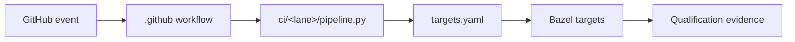

<p align="center">
  <a href="../README.md"></a>
</p>

[← Repository home](../README.md) · [GitHub workflows](../.github/README.md) · [Validation](../VALIDATION.md)

# Continuous integration

> **Maturity:** Mixed; presubmit and repository checks are implemented, while
> hardware, connected-provider, and release lanes retain explicit activation
> gates.
> **Primary implementation:** Python orchestration and Bazel target selection.

`ci/` defines what each automation lane validates. Workflow files under
`.github/workflows/` decide when lanes run; CI code here selects repository-owned
targets and records evidence.

## Pipeline model



## What's here

| Path | Responsibility |
| --- | --- |
| [`common/`](common/) | Affected-target analysis, environment, matrix, reporting, and evidence helpers |
| [`presubmit/`](presubmit/) | Pull-request architecture and test selection |
| [`security/`](security/) | Security analysis and policy checks |
| [`gpu/`](gpu/) | Accelerator qualification target selection |
| [`nightly/`](nightly/) | Broader scheduled qualification |
| [`release/`](release/) | Release target selection and evidence boundaries |
| [`terraform/`](terraform/) | Terraform and infrastructure validation |

## Boundary

- CI selects targets; Bazel remains the test execution authority.
- Workflow YAML coordinates identity, permissions, triggers, and reusable
  workflows; it does not duplicate build or release logic.
- A reserved or fail-closed lane is not evidence that its external runners,
  identities, providers, or release plane are active.

## Start here

Run the provider-independent presubmit checks from the repository root:

```bash
tools/dev/nixw develop .#default
python3 ci/presubmit/pipeline.py --static-only
```

Read [`presubmit/README.md`](presubmit/README.md) for lane details and
[`../.github/README.md`](../.github/README.md) before changing workflow job IDs,
permissions, or reusable-workflow references.
