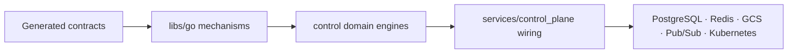

  

[← Repository home](../README.md) · [Control-plane architecture](../docs/architecture/control-plane.md) · [Maturity](../SCAFFOLD_STATUS.md)

# Go control-plane domains

> **Maturity:** Substantive domain contracts and tests exist; deployability
> still depends on service wiring and connected-provider qualification.
> **Primary implementation:** Go.

`control/` contains reusable domain policy and durable state machines. It sits
between generated contracts and `libs/go` mechanisms on one side and deployable
`services/control_plane` composition roots on the other.

## What's here

| Domain group | Paths | Responsibility |
| --- | --- | --- |
| Runtime authority | [`admission/`](admission/), [`routing/`](routing/), [`runtime_authority/`](runtime_authority/) | Admission, route selection, execution tickets, and local-verification policy |
| Run orchestration | [`runs/`](runs/), [`scheduling/`](scheduling/), [`orchestration/`](orchestration/) | Durable run state, placement, leases, and execution coordination |
| Data and evaluation | [`ingestion/`](ingestion/), [`evaluations/`](evaluations/) | Source workflow state, evaluation requests, and evidence coordination |
| Registry and metadata | [`registry/`](registry/), [`metadata/`](metadata/), [`lineage/`](lineage/) | Catalog authority, metadata, lineage, references, and releases |
| Artifacts and weights | [`artifacts/`](artifacts/), [`weights/`](weights/) | Artifact identity, grants, model-weight policy, and lifecycle |
| Governance | [`tenancy/`](tenancy/), [`usage/`](usage/), [`audit/`](audit/), [`events/`](events/), [`webhooks/`](webhooks/) | Tenant policy, quotas, audit, events, and outbound notifications |

## Boundary

Control packages own validation, resource state, workflow decisions, narrow
repository interfaces, policy, and domain events. They do not own provider
clients, process signals, HTTP/gRPC server lifecycle, Rust/Python execution,
model numerics, or scientific preprocessing.

Durable writes emit events through the shared transactional outbox. Long-running
work uses shared fenced leases and work queues. Generic lifecycle, retry, error,
identifier, transaction, coordination, and observability mechanisms come from
[`libs/go/`](../libs/go/).

## Start here

- [Control-plane architecture](../docs/architecture/control-plane.md)
- [Runtime authority and stage execution](../docs/architecture/runtime-authority-and-stage-execution.md)
- [Go foundation adoption](../docs/guides/go-foundation-adoption.md)
- [`services/control_plane/README.md`](../services/control_plane/README.md) for
  deployable composition

A domain implementation is not a deployable service until real providers are
wired and the applicable `PRODUCTION_READINESS.md` and qualification gates pass.
