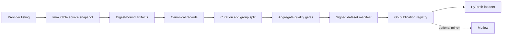

# Data context

This is the semantic map for `data/`. It is intentionally provider-neutral;
warehouse table names, deployed projects, retention periods, and SLO values are
environment configuration and must be qualified separately.

## Core entities and identities

| Entity | Stable identity | Required binding | Main owner |
| --- | --- | --- | --- |
| Source snapshot | provider + source + immutable cursor | snapshot digest | Go control plane |
| Artifact | credential-free URI + generation/version | SHA-256 digest and byte size | object storage |
| Canonical record | canonical content digest | source artifact and schema | Python ingestion |
| Sample | stable sample ID | provenance, group ID, split | Python data semantics |
| Dataset version | dataset ID + version + manifest digest | artifacts, schema, transforms, split, quality, lineage, uses | Go registry |
| Reference snapshot | source + release + digest | artifacts, index, compatible tools | reference catalog |
| Batch | ordered sample IDs + schema | collated features and provenance | PyTorch loader |

Mutable names such as `latest`, object paths without a generation/version, or a
provider's current branch are discovery inputs. They are never acceptable as a
published dataset, reference, training, evaluation, or release identity.

## Standard dimensions, filters, and metrics

- Dimensions: source, immutable snapshot, schema version, transformation
  version, tokenizer/feature version, split, group, classification, license,
  consent status, and publication state.
- Required filters before release: allowed license/use, consent when applicable,
  safety policy, integrity, schema compatibility, duplicate policy, group split
  isolation, evaluation overlap, and hidden-set access evidence.
- Quality metrics are aggregate-only: accepted/rejected/coalesced counts,
  duplicate rate, missingness, distribution summaries, drift distance, group
  leakage count, overlap count, and configured bias ratios.
- Operational metrics must add provider request latency/error/retry volume,
  bytes/records processed, cursor lag, queue depth, worker utilization, and
  publication-gate decisions. Exact names and SLO thresholds are environment
  policy, not universal scientific constants.

## Semantic gotchas

- A row, record, biological entity, and model sample are not interchangeable.
  `Sample.group_id` is the leakage unit and may intentionally group many rows.
- Duplicate primary keys may be coalesced only when canonical payloads agree;
  conflicting payloads are deterministic rejections.
- Split assignment precedes augmentation and stochastic sampling. Changing the
  split policy creates a new dataset identity.
- A tokenizer vocabulary, feature extractor, reference database, or mixture
  change creates a new version even when source records are unchanged.
- Quality pass means configured gates passed for the pinned inputs. It does not
  prove scientific suitability for uses missing from the dataset card.
- MLflow run metadata is a mirror for discoverability. The signed manifest,
  durable registry record, and object-store artifact remain authoritative.

## Data flow

The same sequence in text is: discover, bind, ingest, curate, split, qualify,
publish through the Go authority, then consume exact versions. MLflow may mirror
the terminal identity but cannot replace the registry.

