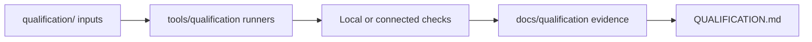

  

[← Repository home](../README.md) · [Qualification record](../QUALIFICATION.md) · [Validation](../VALIDATION.md)

# Qualification inputs

> **Purpose:** Reviewed package sets and inputs consumed by qualification lanes;
> this directory is not the evidence record itself.

`qualification/` separates provider-independent package sets from packages that
require connected services or environments.

## What's here

| Path | Responsibility |
| --- | --- |
| [`go/offline-safe-packages.txt`](go/offline-safe-packages.txt) | Go packages eligible for provider-independent qualification |
| [`go/connected-provider-packages.txt`](go/connected-provider-packages.txt) | Go packages requiring connected provider environments |

## Evidence flow

## Boundary

- Lists select scope; they do not prove that a check ran or passed.
- Evidence must record the environment, toolchain, inputs, result, and relevant
  limitations.
- Connected-provider evidence cannot be replaced by an offline fixture.

## Start here

- [`QUALIFICATION.md`](../QUALIFICATION.md) for the current evidence summary
- [`VALIDATION.md`](../VALIDATION.md) for required commands and environments
- [`docs/qualification/README.md`](../docs/qualification/README.md) for retained
  evidence
- [`tools/qualification/README.md`](../tools/qualification/README.md) for lane
  implementations
